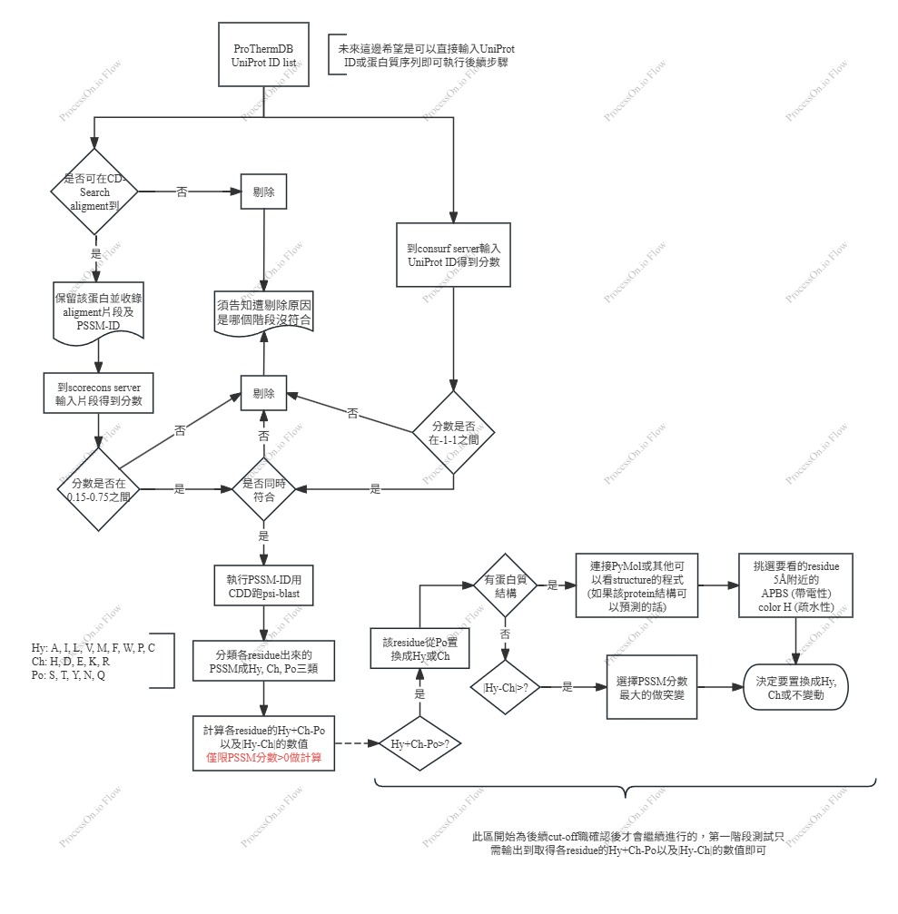

# Protein Analysis Pipeline (PSSM)



## Project Structure

```
PSSM/
├── src/
│   ├── main.py                  # Unified pipeline entry point
│   └── preprocess/
│       ├── run_cdsearch.py
│       ├── run_domain_psiblast.py
│       └── run_pssm_features.py
├── scripts/
│   ├── setup_cdd.sh             # One-time setup for CDD RPS-BLAST DB
│   ├── cdsearch.sh              # Run CD-Search alignment stage
│   └── pssm.sh                  # Run PSI-BLAST and PSSM feature extraction (Stage 2+3)
├── data/
│   ├── raw/                     # Input protein lists
│   ├── processed/               # FASTA files and metadata
└── blastdb/
│   └── cdd/                     # RPS-BLAST CDD database
│   └── cdd.tar                  # Archived CDD package
├── env/
│   └── pssm.yml                 # Conda environment definition
├── docs/
│   └── workflow_diagram.jpg     # Full process flowchart (as reference)
```

## Getting Started

### Environment Setup

```bash
conda env create -f env/pssm.yml
conda activate pssm
```

Environment includes `biopython`, `pandas`, and `blast+`.

---

## One-Time: Setup CDD Database for RPS-BLAST

```bash
bash scripts/setup_cdd.sh <PROJECT_DIR>
```

Extracts `.smp` profiles and builds RPS-BLAST DB (`Cdd.pn`).

---

## Stage 1 – CD-Search Alignment (RPS-BLAST)

Identifies conserved domains for each query sequence.

### Run

```bash
bash scripts/cdsearch.sh <PROJECT_DIR> [/path/to/input.fasta]
```

If no FASTA is provided, defaults to `data/processed/proteins_wt.fasta`.

### Output

| File / Folder                                    | Description                |
| ------------------------------------------------ | -------------------------- |
| `results/cdsearch_results/cdsearch_all_hits.tsv` | All detected domains       |
| `results/cdsearch_results/cdsearch_top_hits.tsv` | Top hit per sequence       |
| `results/cdsearch_results/domains_fasta/`        | Extracted domain fragments |
| `results/cdsearch_results/cdsearch_metadata.tsv` | Alignment metadata summary |

### Example

```text
query_id    PSSM_ID        pident   evalue      bitscore  qstart  qend  domain_seq
P00004      gnl|CDD|231391 86.667   1.21e-58   175.0     1       105    MKTAYIAKQRQ...
P00651      gnl|CDD|238339 69.608   9.6e-47    146.0     29      130    YDNLKFLNVH...
```

---

## Stage 2 + 3 – Domain-Level PSI-BLAST and PSSM Feature Extraction

This combined stage performs **PSI-BLAST** for all domain fragments obtained from Stage 1,
and subsequently extracts PSSM matrices while computing biochemical group features.

### Run

```bash
bash scripts/pssm.sh <PROJECT_DIR>
```

### Step 2 – Domain-Level PSI-BLAST (PSSM Profile Construction)

Performs **PSI-BLAST** on each domain fragment.

Generates `.pssm` profiles in `results/domain_psiblast/pssm_profiles/`.

| File / Folder      | Description         |
| ------------------ | ------------------- |
| `pssm_profiles/`   | ASCII PSSM profiles |
| `psi_metadata.tsv` | Run summary         |
| `psi_error.log`    | Error log           |

---

### Step 3 – PSSM Feature Extraction and Matrix Computation

Extracts 20×L PSSM matrices and computes Po / Hy / Ch + derived metrics.

| Feature       | Description                             |
| ------------- | --------------------------------------- |
| **Po**        | Polar (S, T, Y, N, Q)                   |
| **Hy**        | Hydrophobic (A, I, L, V, M, F, W, P, C) |
| **Ch**        | Charged (H, D, E, K, R)                 |
| **Hy+Ch-Po**  | Combined hydrophobic + charged tendency |
| **\|Hy-Ch\|** | Absolute difference                     |

### Example Output

```text
pos  aa  A  R  N  D  C  Q  E  G  H  I  L  K  M  F  P  S  T  W  Y  V  Po  Hy  Ch  Hy+Ch-Po  |Hy-Ch|
1    G   0 -2  0 -1 -3 -2 -2  6 -2 -4 -4 -2 -3 -3 -2  0 -2 -3 -3 -3   2   8   4      10        4
2    D  -2 -2  1  6 -4  0  2 -1 -1 -3 -4 -1 -3 -4 -2  0 -1 -4 -3 -3   3   6   7      10        1
```

---

## Unified Pipeline

```bash
bash scripts/cdsearch.sh <PROJECT_DIR> /path/to/input.fasta
bash scripts/pssm.sh <PROJECT_DIR>
```

**Data Flow:**

```
Input FASTA ─▶ CD-Search ─▶ Domain Fragments ─▶ PSI-BLAST ─▶ PSSM Matrices
```

---

## Final Output Hierarchy

```
results/
├── cdsearch_results/
│   ├── cdsearch_all_hits.tsv
│   ├── cdsearch_top_hits.tsv
│   ├── domains_fasta/
│   └── cdsearch_metadata.tsv
└── domain_psiblast/
    ├── psi_metadata.tsv
    ├── psi_error.log
    ├── pssm_profiles/
    ├── pssm_matrices/
    └── pssm_extract_error.log
```

---
