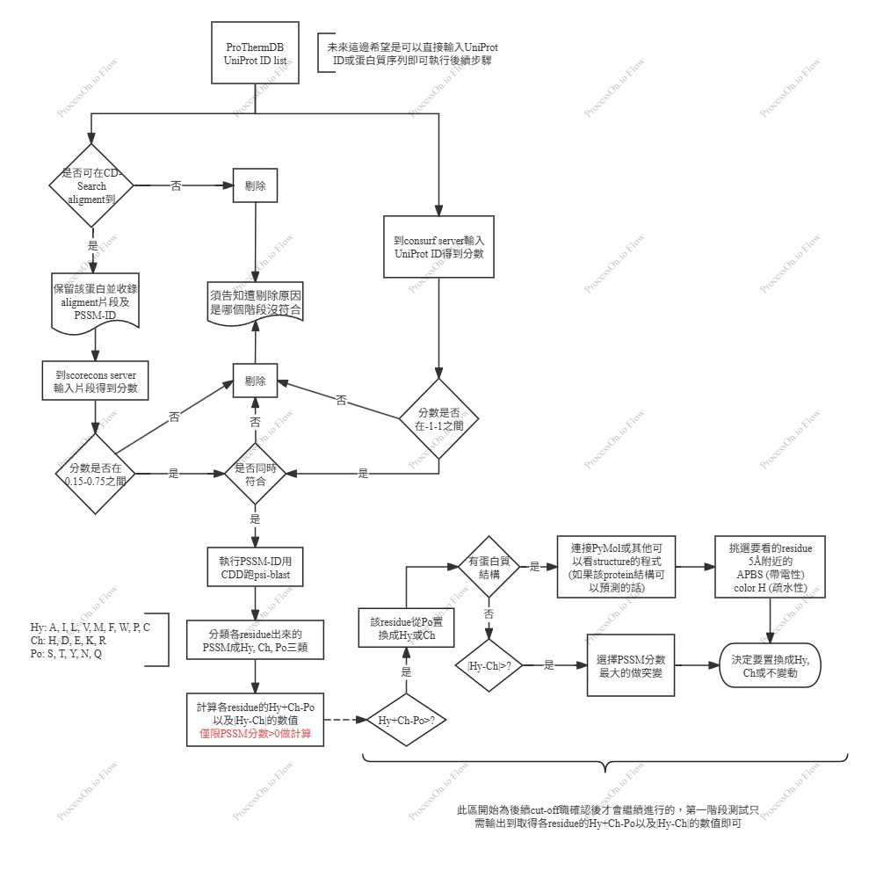

# Protein Analysis Pipeline (PSSM)



## Project Structure

```
PSSM/
├── src/
│   ├── main.py                  # Unified pipeline entry point
│   └── preprocess/
│       ├── run_cdsearch.py
│       ├── run_domain_psiblast.py
│       ├── run_pssm_features
│       ├── run_pssm_reconstruct.py
│       └── run_conservation_reconstruct
│
├── scripts/
│   ├── setup_cdd.sh             # One-time setup for CDD RPS-BLAST DB
│   ├── cdsearch.sh              # Run CD-Search alignment stage
│   ├── pssm.sh                  # Run PSI-BLAST and PSSM feature extraction (Stage 2+3)
│   └── conservation.sh          # Run conservation score reconstruction (Stage 4)
│
├── data/
│   ├── raw/                     # Input protein lists
│   └── processed/               # FASTA files and metadata
│
└── blastdb/
│   ├── cdd/                     # RPS-BLAST CDD database
│   └── cdd.tar                  # Archived CDD package
│
├── env/
│   └── pssm.yml                 # Conda environment definition
│
├── docs/
│   └── workflow_diagram.jpg     # Full process flowchart (as reference)
```

## Getting Started

### Environment Setup

```bash
conda env create -f env/pssm.yml
conda activate pssm
```

Environment includes `biopython`, `pandas`, and `blast+`.

## One-Time: Setup CDD Database for RPS-BLAST

```bash
bash scripts/setup_cdd.sh <PROJECT_DIR>
```

This step extracts `.smp` profiles and builds the RPS-BLAST CDD database (`Cdd.pn`).

## Input FASTA Requirements

The pipeline requires a **protein FASTA file** as input.
Each sequence must follow a standardized header naming convention to ensure correct
tracking of wild-type and mutant proteins throughout the analysis.

### FASTA Header Naming Rules

Each FASTA record must use the following format:

- **Wild-type sequence** : {UniProt_ID}
- **Mutant sequence** : {UniProt_ID}\_{mutation}

Where:

- `{UniProt_ID}` is the official UniProt accession ID
- `{mutation}` follows standard mutation notation
  (e.g., `A53L`, meaning Alanine at position 53 mutated to Leucine)

### Examples

```fasta
>D4Z2G1
MSLGAKPFGEKKFIEIKGRRMAYIDEGTGDPILFQHGNPTSSYLWRNIMPHCAGLGRLIACDLIGMGDSDKLDPSGPERYAYAEHRDYLDALWEALDLGDRVVLVVHDWGSALGFDWARRHRERVQGIAYMEAIAMPIEWADFPEQDRDLFQAFRSQAGEELVLQDNVFVEQVLPGLILRPLSEAEMAAYREPFLAAGEARRPTLSWPRQIPIAGTPADVVAIARDYAGWLSESPIPKLFINAEPGALTTGRMRDFCRTWPNQTEITVAGAHFIQEDSPDEIGAAIAAFVRRLRPA

>D4Z2G1_A53L
MSLGAKPFGEKKFIEIKGRRMAYIDEGTGDPILFQHGNPTSSYLWRNIMPHCLGLGRLIACDLIGMGDSDKLDPSGPERYAYAEHRDYLDALWEALDLGDRVVLVVHDWGSALGFDWARRHRERVQGIAYMEAIAMPIEWADFPEQDRDLFQAFRSQAGEELVLQDNVFVEQVLPGLILRPLSEAEMAAYREPFLAAGEARRPTLSWPRQIPIAGTPADVVAIARDYAGWLSESPIPKLFINAEPGALTTGRMRDFCRTWPNQTEITVAGAHFIQEDSPDEIGAAIAAFVRRLRPA
```

## Stage 1 – CD-Search Alignment (RPS-BLAST)

Identifies conserved domains for each query protein sequence.

### Run

```bash
bash scripts/cdsearch.sh <PROJECT_DIR> [/path/to/input.fasta]
```

### Output

| File / Folder                                    | Description                |
| ------------------------------------------------ | -------------------------- |
| `results/cdsearch_results/cdsearch_all_hits.tsv` | All detected domains       |
| `results/cdsearch_results/cdsearch_top_hits.tsv` | Top hit per sequence       |
| `results/cdsearch_results/domains_fasta/`        | Extracted domain fragments |
| `results/cdsearch_results/cdsearch_metadata.tsv` | Alignment metadata summary |

### Example

```text
query_id    PSSM_ID        pident   evalue      bitscore  qstart  qend  domain_seq
P00004      gnl|CDD|231391 86.667   1.21e-58   175.0     1       105    MKTAYIAKQRQ...
P00651      gnl|CDD|238339 69.608   9.6e-47    146.0     29      130    YDNLKFLNVH...
```

## Stage 2 + 3 – Domain-Level PSI-BLAST and PSSM Construction

This combined stage performs **PSI-BLAST** for all domain fragments obtained from Stage 1,
and subsequently extracts PSSM matrices while computing biochemical group features.

### Run

```bash
bash scripts/pssm.sh <PROJECT_DIR> [/path/to/input.fasta]
```

### Step 2 – Domain-Level PSI-BLAST (PSSM Profile Construction)

Performs **PSI-BLAST** on each domain fragment.

Generates `.pssm` profiles in `results/domain_psiblast/pssm_profiles/`.

| File / Folder      | Description         |
| ------------------ | ------------------- |
| `pssm_profiles/`   | ASCII PSSM profiles |
| `psi_metadata.tsv` | Run summary         |
| `psi_error.log`    | Error log           |

### Step 3 – PSSM Feature Extraction and Matrix Computation

Extracts 20×L PSSM matrices and computes Po / Hy / Ch + derived metrics.

| Feature       | Description                             |
| ------------- | --------------------------------------- |
| **Po**        | Polar (S, T, Y, N, Q)                   |
| **Hy**        | Hydrophobic (A, I, L, V, M, F, W, P, C) |
| **Ch**        | Charged (H, D, E, K, R)                 |
| **Hy+Ch-Po**  | Combined hydrophobic + charged tendency |
| **\|Hy-Ch\|** | Absolute difference                     |

### Example Output

```text
pos  aa  A  R  N  D  C  Q  E  G  H  I  L  K  M  F  P  S  T  W  Y  V  Po  Hy  Ch  Hy+Ch-Po  |Hy-Ch|
1    G   0 -2  0 -1 -3 -2 -2  6 -2 -4 -4 -2 -3 -3 -2  0 -2 -3 -3 -3   2   8   4      10        4
2    D  -2 -2  1  6 -4  0  2 -1 -1 -3 -4 -1 -3 -4 -2  0 -1 -4 -3 -3   3   6   7      10        1
```

## Stage 4 – Conservation Reconstruction and Integration

This stage reconstructs **full-length residue-wise conservation profiles**
by integrating multiple external conservation sources
into the unified UniProt reference coordinate system.

Two complementary conservation methods are supported:

- **Scorecons** – domain-based conservation derived from CD-Search alignments
- **ConSurf** – residue-level evolutionary conservation derived from MSA

Both conservation scores are projected back to the
**full-length reference protein sequence**
and merged with reconstructed PSSM feature tables.

### Overview

This stage serves as the bridge between
domain-level evolutionary analysis and
full-length residue-wise feature representation.

It enables:

- Projection of conservation scores onto absolute UniProt coordinates
- Integration of heterogeneous conservation sources
- Construction of a unified residue-level conservation table

## Stage 4.1 – Scorecons-Based Conservation Reconstruction

This sub-stage reconstructs **full-length conservation scores**
by projecting **domain-level Scorecons results**
back to original protein coordinates using CD-Search alignment metadata.

This step integrates external MSA-based conservation analysis
with internally reconstructed full-length PSSM tables.

### ⚠️ Important Prerequisite: Scorecons Server Results

This pipeline **does not perform multiple sequence alignment (MSA)**
or conservation score computation internally.

Users must first compute conservation scores using the
**Scorecons web server** and place the output files
into the designated directory.

### Required Directory Structure (Scorecons)

Before running this stage, the following directory structure must exist:

```
results/
├── conservation/
│   └── scorecons/
│       └── *.txt
```

The `query_id` must exactly match the FASTA header
and CD-Search query ID.

During execution, the pipeline will automatically generate:

```
results/
├── conservation/
│   └── reconstruct/
│       └── *.tsv
```

## Stage 4.2 – ConSurf Evolutionary Conservation Integration

This sub-stage integrates **residue-level evolutionary conservation scores**
generated by **ConSurf** into the reconstructed full-length tables.

Unlike Scorecons, which is computed at the domain level,
ConSurf conservation scores are derived from full-sequence MSA
and often use sequence versions that differ slightly
from the UniProt reference sequence.

To address this, the pipeline implements an
**alignment-free, variant-aware local sequence mapping strategy**
to accurately project ConSurf scores back to
**absolute UniProt residue coordinates**.

### Design Principles

The ConSurf integration module follows several strict constraints:

- **Alignment-free mapping**
  No global or pairwise sequence alignment is performed.

- **Gap-free coordinate system**
  No artificial gap positions are introduced.

- **Variant-aware reconstruction**
  Mutant sequences are restored to wild-type residues before mapping.

- **Window-based local sequence matching**
  Local similarity is detected using a sliding-window strategy.

- **UniProt reference as absolute coordinate system**
  All final conservation scores correspond to UniProt residue positions.

### Required Directory Structure (ConSurf)

Before running this stage, ConSurf analysis must be completed externally.

```
results/
├── evolutionary_conservation/
│   └── consurf/
│       └── *_consurf_grades.txt
```

Each ConSurf grades file must match the corresponding query ID
used in the input FASTA file.

During execution, ConSurf scores are merged into:

```
results/
├── evolutionary_conservation/
│   └── reconstruct/
│       └── *.tsv
```

### Run

Both Scorecons reconstruction and ConSurf integration
are executed using the same pipeline script:

```bash
bash scripts/conservation.sh <PROJECT_DIR> [/path/to/input.fasta]
```

## Stage 5 – Conservation-Based PSSM Feature Filtering

This final stage performs **conservation-aware masking of PSSM-derived features**.

All residue positions are preserved;
however, PSSM profile features are selectively masked (`NA`)
if evolutionary conservation criteria are not satisfied.

This strategy reduces noise introduced by weakly conserved regions
while maintaining complete positional coverage of protein sequences.

### Filtering Criteria

For each residue position, PSSM-derived features are retained only if
**both conservation conditions are satisfied**:

```text
EC_MIN ≤ Evolutionary conservation ≤ EC_MAX
CONS_MIN ≤ Conservation (Scorecons) ≤ CONS_MAX
```

Where:

- **Evolutionary conservation** refers to ConSurf-derived scores in Stage 4.2
- **Conservation (Scorecons)** refers to domain-based conservation reconstructed in Stage 4.1

### Run

```bash
bash scripts/conservation_filter.sh <PROJECT_DIR> <CONS_MIN> <CONS_MAX> <EC_MIN> <EC_MAX>
```

## Unified Pipeline

```bash
bash scripts/cdsearch.sh <PROJECT_DIR> [/path/to/input.fasta]
bash scripts/pssm.sh <PROJECT_DIR> [/path/to/input.fasta]
bash scripts/conservation.sh <PROJECT_DIR> [/path/to/input.fasta]
```

**Data Flow:**

```
Input FASTA
 ─▶ CD-Search
 ─▶ Domain Fragments
 ─▶ PSI-BLAST
 ─▶ Domain PSSM Profiles
 ─▶ Domain PSSM Matrices
 ─▶ Full-length PSSM Reconstruction
 ─▶ Scorecons (external)
 ─▶ ConSurf (external)
 ─▶ Conservation Reconstruction & Integration
```

## Final Output Hierarchy

```
results/
├── cdsearch_results/
│   ├── alignment_blocks/
│   ├── intermediate/
│   ├── domains_fasta/
│   ├── cdsearch_all_hits_detailed.tsv
│   ├── cdsearch_top_hits_detailed.tsv
│   └── cdsearch_metadata.tsv
│
├── domain_psiblast/
│   ├── psi_metadata.tsv
│   ├── psi_error.log
│   ├── pssm_profiles/
│   ├── pssm_matrices/
│   ├── pssm_reconstruct/
│   │   └── *.tsv
│   ├── pssm_extract_error.log
│   └── pssm_reconstruct_error.log
│
├── conservation/
│   ├── scorecons/
│   │   └── *.txt
│   ├── reconstruct/
│   │   └── *.tsv
│
└── conservation_filtered/
    └── *.tsv
```

## Final Model-Ready Features

The final residue-level feature matrices used for downstream
statistical analysis or machine learning models are located in:

```
results/conservation_filtered/*.tsv
```
